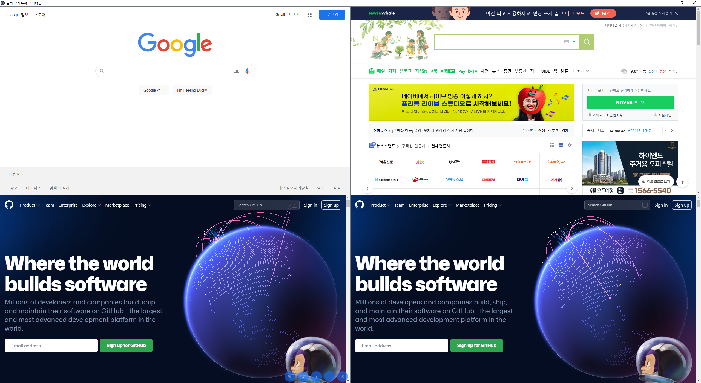

# Multi Browser Monitoring

여러 브라우저를 심플하게 관리하고 꽉 찬 화면으로 모니터링 할 수 있습니다.

Node version: v16.14.0

## Resources for Learning Electron

- [electronjs.org/docs](https://electronjs.org/docs) - all of Electron's documentation
- [electronjs.org/community#boilerplates](https://electronjs.org/community#boilerplates) - sample starter apps created by the community
- [electron/electron-quick-start](https://github.com/electron/electron-quick-start) - a very basic starter Electron app
- [hokein/electron-sample-apps](https://github.com/hokein/electron-sample-apps) - small demo apps for the various Electron APIs

## License

[CC0 1.0 (Public Domain)](LICENSE.md)
